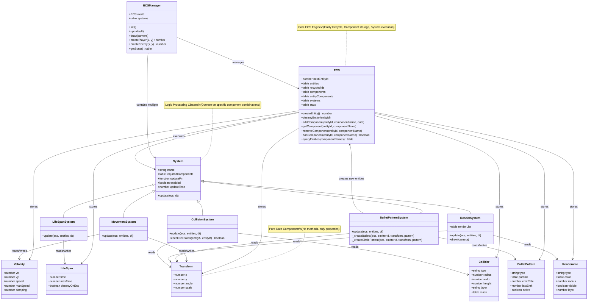
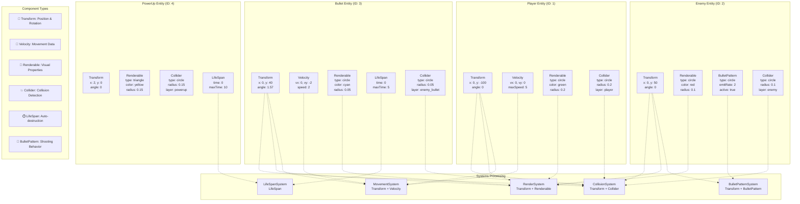

# 05. ECS 구현 가이드 (Entity-Component-System Implementation)

> Vector Swarm을 위한 고성능 모바일 최적화 ECS 아키텍처

---

## 1. ECS 개요 및 목표

### 1.1 왜 ECS인가?

**문제점:**
- 1000+ 탄막 + 적 + 파워업 동시 처리 필요
- 전통적 OOP는 상속 계층이 복잡해짐
- 모바일 메모리/CPU 제약

**ECS 해결책:**
- **데이터 지향 설계**: CPU 캐시 친화적
- **컴포지션 기반**: 유연한 기능 조합
- **배치 처리**: 같은 컴포넌트를 가진 엔티티들을 한 번에 처리

### 1.2 성능 목표

| 메트릭 | 목표 | 측정 방법 |
|--------|------|-----------|
| 동시 엔티티 수 | 2000+ | 탄막(1500) + 적(100) + 기타(400) |
| 프레임레이트 | 60fps 고정 | love.timer.getFPS() |
| 메모리 사용량 | < 50MB | collectgarbage("count") |
| 시스템 업데이트 | < 12ms/frame | 프로파일링 |

---

## 2. ECS 클래스 구조 및 관계도

### 2.1 클래스 관계도 (Class Diagram)



### 2.2 주요 클래스 역할 설명

| 클래스 | 역할 | 특징 |
|--------|------|------|
| **ECS** | 핵심 ECS 엔진 | 엔티티 생성/삭제, 컴포넌트 저장, 쿼리 처리 |
| **ECSManager** | 전체 관리자 | ECS 월드와 시스템들을 통합 관리 |
| **System** | 시스템 기반 클래스 | 특정 컴포넌트 조합에 대한 로직 처리 |
| **Components** | 순수 데이터 구조체 | 메소드 없이 데이터만 포함 |
| **Concrete Systems** | 구체적 시스템들 | Movement, LifeSpan, BulletPattern, Render, Collision |

### 2.3 데이터 흐름 (Data Flow)

```
Entity Creation → Component Assignment → System Processing → Rendering
     ↓                    ↓                    ↓              ↓
  ECS.createEntity()  ECS.addComponent()  System.update()  RenderSystem.draw()
```

**실행 순서:**
1. **Entity 생성**: `ECSManager.createPlayer()` → `ECS.createEntity()`
2. **Component 부착**: Transform, Velocity, Renderable 등 추가
3. **System 처리**: 각 시스템이 해당 컴포넌트를 가진 엔티티들 처리
4. **렌더링**: RenderSystem이 수집한 데이터를 Camera로 그리기

### 2.4 Entity 구성 예제 (Entity Composition Examples)



**Entity 유형별 컴포넌트 조합:**

| Entity 유형 | 필수 컴포넌트 | 선택 컴포넌트 | 시스템 처리 |
|-------------|---------------|---------------|-------------|
| **Player** | Transform, Renderable, Collider | Velocity, HealthPoints | Movement, Collision, Render |
| **Enemy** | Transform, Renderable, BulletPattern | Collider, AI, HealthPoints | BulletPattern, Collision, AI, Render |
| **Bullet** | Transform, Velocity, LifeSpan | Renderable, Collider | Movement, LifeSpan, Collision, Render |
| **PowerUp** | Transform, Renderable, LifeSpan | Collider, PickupEffect | LifeSpan, Collision, Pickup, Render |

---

## 3. ECS 핵심 구조

### 2.1 Entity (엔티티)

엔티티는 단순한 **고유 ID**입니다.

```lua
-- src/01_core/ecs.lua
local ECS = {}
ECS.__index = ECS

function ECS.new()
    local ecs = setmetatable({
        -- Entity management
        nextEntityId = 1,
        entities = {},          -- {[entityId] = true, ...}
        recycledIds = {},       -- 재사용 가능한 ID 스택
        
        -- Component storage
        components = {},        -- {[componentName] = {[entityId] = componentData, ...}}
        entityComponents = {},  -- {[entityId] = {componentName1, ...}}
        
        -- System management
        systems = {},           -- {system1, system2, ...}
        systemQueries = {},     -- {[systemName] = {componentNames}, ...}
        
        -- Performance stats
        stats = {
            entityCount = 0,
            systemUpdateTime = 0
        }
    }, ECS)
    
    return ecs
end

-- 엔티티 생성
function ECS:createEntity()
    local entityId
    
    if #self.recycledIds > 0 then
        -- 재사용 ID 사용
        entityId = table.remove(self.recycledIds)
    else
        -- 새 ID 발급
        entityId = self.nextEntityId
        self.nextEntityId = self.nextEntityId + 1
    end
    
    self.entities[entityId] = true
    self.entityComponents[entityId] = {}
    self.stats.entityCount = self.stats.entityCount + 1
    
    return entityId
end

-- 엔티티 삭제
function ECS:destroyEntity(entityId)
    if not self.entities[entityId] then return end
    
    -- 모든 컴포넌트 제거
    for componentName in pairs(self.entityComponents[entityId]) do
        self:removeComponent(entityId, componentName)
    end
    
    -- 엔티티 제거
    self.entities[entityId] = nil
    self.entityComponents[entityId] = nil
    
    -- ID 재사용 풀에 추가
    table.insert(self.recycledIds, entityId)
    
    self.stats.entityCount = self.stats.entityCount - 1
end
```

### 2.2 Components (컴포넌트)

컴포넌트는 **순수한 데이터**만 포함합니다.

```lua
-- src/03_game/components/Transform.lua
return {
    x = 0,           -- 월드 X 좌표
    y = 0,           -- 월드 Y 좌표 
    angle = 0,       -- 회전각 (라디안)
    scale = 1        -- 크기 배율
}

-- src/03_game/components/Velocity.lua  
return {
    vx = 0,          -- X 방향 속도
    vy = 0,          -- Y 방향 속도
    speed = 0,       -- 속력 (벡터 크기)
    maxSpeed = 10,   -- 최대 속력 제한
    damping = 0.98   -- 감속 계수 (0.98 = 2% 감속)
}

-- src/03_game/components/Collider.lua
return {
    type = "circle", -- "circle", "aabb", "point"
    radius = 0.5,    -- 원형 충돌체 반지름
    width = 1,       -- AABB 가로 크기 
    height = 1,      -- AABB 세로 크기
    layer = "default", -- 충돌 레이어 ("player", "enemy", "bullet")
    mask = {"enemy", "bullet"} -- 충돌할 레이어들
}

-- src/03_game/components/LifeSpan.lua
return {
    time = 0,        -- 현재 생존 시간
    maxTime = 5,     -- 최대 생존 시간 (초)
    destroyOnEnd = true -- 시간 종료 시 자동 삭제
}

-- src/03_game/components/BulletPattern.lua
return {
    type = "circle", -- "circle", "spiral", "wave", "homing"
    params = {},     -- 패턴별 파라미터
    emitRate = 10,   -- 초당 발사 횟수
    lastEmit = 0,    -- 마지막 발사 시간
    active = true    -- 패턴 활성화 상태
}

-- src/03_game/components/Renderable.lua
return {
    type = "circle", -- "circle", "triangle", "line"
    color = {1, 1, 1, 1}, -- RGBA (0-1 범위)
    radius = 0.1,    -- 원형 렌더링 시 반지름
    visible = true,  -- 렌더링 여부
    layer = 0        -- 렌더링 레이어 (Z-order)
}
```

### 2.3 Component Management (컴포넌트 관리)

```lua
-- ECS 클래스 계속...

-- 컴포넌트 추가
function ECS:addComponent(entityId, componentName, componentData)
    if not self.entities[entityId] then
        logError(string.format("Entity %d does not exist", entityId))
        return false
    end
    
    -- 컴포넌트 스토리지 초기화 (필요시)
    if not self.components[componentName] then
        self.components[componentName] = {}
    end
    
    -- 컴포넌트 데이터 저장 (깊은 복사)
    self.components[componentName][entityId] = self:_deepCopy(componentData)
    
    -- 엔티티의 컴포넌트 목록에 추가
    self.entityComponents[entityId][componentName] = true
    
    return true
end

-- 컴포넌트 조회
function ECS:getComponent(entityId, componentName)
    if not self.entities[entityId] then return nil end
    
    local componentStorage = self.components[componentName]
    return componentStorage and componentStorage[entityId]
end

-- 컴포넌트 제거
function ECS:removeComponent(entityId, componentName)
    if not self.entities[entityId] then return false end
    
    if self.components[componentName] then
        self.components[componentName][entityId] = nil
    end
    
    if self.entityComponents[entityId] then
        self.entityComponents[entityId][componentName] = nil
    end
    
    return true
end

-- 컴포넌트 존재 여부 확인
function ECS:hasComponent(entityId, componentName)
    return self.entityComponents[entityId] and 
           self.entityComponents[entityId][componentName] == true
end

-- 복수 컴포넌트 확인
function ECS:hasComponents(entityId, componentNames)
    for _, componentName in ipairs(componentNames) do
        if not self:hasComponent(entityId, componentName) then
            return false
        end
    end
    return true
end
```

---

## 3. System Architecture (시스템 아키텍처)

### 3.1 System Base Class

```lua
-- src/01_core/System.lua
local System = {}
System.__index = System

function System.new(name, requiredComponents, updateFn)
    local system = setmetatable({
        name = name,
        requiredComponents = requiredComponents or {},
        updateFn = updateFn,
        enabled = true,
        updateTime = 0  -- 성능 측정용
    }, System)
    
    return system
end

function System:update(ecs, dt)
    if not self.enabled then return end
    
    local startTime = love.timer.getTime()
    
    -- 쿼리: 필요한 컴포넌트를 가진 엔티티들 찾기
    local entities = ecs:queryEntities(self.requiredComponents)
    
    -- 시스템별 업데이트 로직 실행
    if self.updateFn then
        self.updateFn(ecs, entities, dt)
    end
    
    self.updateTime = love.timer.getTime() - startTime
end

return System
```

### 3.2 Entity Query (엔티티 쿼리)

```lua
-- ECS 클래스 계속...

-- 특정 컴포넌트들을 가진 엔티티들 조회
function ECS:queryEntities(componentNames)
    local results = {}
    
    if #componentNames == 0 then
        -- 컴포넌트 조건 없음: 모든 엔티티
        for entityId in pairs(self.entities) do
            table.insert(results, entityId)
        end
        return results
    end
    
    -- 가장 적은 수의 엔티티를 가진 컴포넌트부터 시작 (최적화)
    local smallestComponent = componentNames[1]
    local smallestCount = self:_getComponentEntityCount(smallestComponent)
    
    for i = 2, #componentNames do
        local componentName = componentNames[i]
        local count = self:_getComponentEntityCount(componentName)
        if count < smallestCount then
            smallestComponent = componentName
            smallestCount = count
        end
    end
    
    -- 가장 작은 컴포넌트의 엔티티들을 대상으로 필터링
    if self.components[smallestComponent] then
        for entityId in pairs(self.components[smallestComponent]) do
            if self:hasComponents(entityId, componentNames) then
                table.insert(results, entityId)
            end
        end
    end
    
    return results
end

function ECS:_getComponentEntityCount(componentName)
    local component = self.components[componentName]
    if not component then return 0 end
    
    local count = 0
    for _ in pairs(component) do
        count = count + 1
    end
    return count
end
```

---

## 4. Core Systems (핵심 시스템 구현)

### 4.1 Movement System

```lua
-- src/03_game/systems/MovementSystem.lua
local System = require("01_core.System")

local MovementSystem = System.new("Movement", {"Transform", "Velocity"}, function(ecs, entities, dt)
    for _, entityId in ipairs(entities) do
        local transform = ecs:getComponent(entityId, "Transform")
        local velocity = ecs:getComponent(entityId, "Velocity")
        
        if transform and velocity then
            -- 기본 운동학: 위치 = 이전위치 + 속도 × 시간
            transform.x = transform.x + velocity.vx * dt
            transform.y = transform.y + velocity.vy * dt
            
            -- 감속 적용 (공기 저항 시뮬레이션)
            if velocity.damping and velocity.damping < 1 then
                velocity.vx = velocity.vx * velocity.damping
                velocity.vy = velocity.vy * velocity.damping
            end
            
            -- 최대 속력 제한
            if velocity.maxSpeed and velocity.maxSpeed > 0 then
                local speed = math.sqrt(velocity.vx^2 + velocity.vy^2)
                if speed > velocity.maxSpeed then
                    local ratio = velocity.maxSpeed / speed
                    velocity.vx = velocity.vx * ratio
                    velocity.vy = velocity.vy * ratio
                end
            end
        end
    end
end)

return MovementSystem
```

### 4.2 LifeSpan System

```lua
-- src/03_game/systems/LifeSpanSystem.lua
local System = require("01_core.System")

local LifeSpanSystem = System.new("LifeSpan", {"LifeSpan"}, function(ecs, entities, dt)
    local toDestroy = {}
    
    for _, entityId in ipairs(entities) do
        local lifespan = ecs:getComponent(entityId, "LifeSpan")
        
        if lifespan then
            lifespan.time = lifespan.time + dt
            
            -- 수명이 다한 엔티티 수집
            if lifespan.time >= lifespan.maxTime and lifespan.destroyOnEnd then
                table.insert(toDestroy, entityId)
            end
        end
    end
    
    -- 수명이 다한 엔티티들 삭제 (순회 중 삭제 방지)
    for _, entityId in ipairs(toDestroy) do
        ecs:destroyEntity(entityId)
    end
end)

return LifeSpanSystem
```

### 4.3 Bullet Pattern System

```lua
-- src/03_game/systems/BulletPatternSystem.lua
local System = require("01_core.System")

local BulletPatternSystem = System.new("BulletPattern", {"Transform", "BulletPattern"}, function(ecs, entities, dt)
    for _, entityId in ipairs(entities) do
        local transform = ecs:getComponent(entityId, "Transform")
        local pattern = ecs:getComponent(entityId, "BulletPattern")
        
        if transform and pattern and pattern.active then
            pattern.lastEmit = pattern.lastEmit + dt
            
            -- 발사 간격 체크
            local emitInterval = 1.0 / pattern.emitRate
            if pattern.lastEmit >= emitInterval then
                pattern.lastEmit = 0
                
                -- 패턴별 탄막 생성
                BulletPatternSystem:_createBullets(ecs, entityId, transform, pattern)
            end
        end
    end
end)

function BulletPatternSystem:_createBullets(ecs, emitterId, transform, pattern)
    if pattern.type == "circle" then
        self:_createCirclePattern(ecs, emitterId, transform, pattern)
    elseif pattern.type == "spiral" then
        self:_createSpiralPattern(ecs, emitterId, transform, pattern)
    -- 다른 패턴들...
    end
end

function BulletPatternSystem:_createCirclePattern(ecs, emitterId, transform, pattern)
    local count = pattern.params.count or 8
    local speed = pattern.params.speed or 2.0
    
    for i = 0, count - 1 do
        local angle = (i / count) * 2 * math.pi
        local vx = math.cos(angle) * speed
        local vy = math.sin(angle) * speed
        
        -- 탄막 엔티티 생성
        local bulletId = ecs:createEntity()
        
        ecs:addComponent(bulletId, "Transform", {
            x = transform.x,
            y = transform.y,
            angle = angle
        })
        
        ecs:addComponent(bulletId, "Velocity", {
            vx = vx,
            vy = vy,
            speed = speed
        })
        
        ecs:addComponent(bulletId, "LifeSpan", {
            time = 0,
            maxTime = 5,
            destroyOnEnd = true
        })
        
        ecs:addComponent(bulletId, "Renderable", {
            type = "circle",
            radius = 0.05,
            color = {0.4, 0.8, 1, 1} -- 하늘색
        })
        
        ecs:addComponent(bulletId, "Collider", {
            type = "circle",
            radius = 0.05,
            layer = "enemy_bullet"
        })
    end
end

return BulletPatternSystem
```

---

## 5. Rendering Integration (렌더링 통합)

### 5.1 Render System (ECS + 기존 렌더러 통합)

```lua
-- src/03_game/systems/RenderSystem.lua
local System = require("01_core.System")

local RenderSystem = System.new("Render", {"Transform", "Renderable"}, function(ecs, entities, dt)
    -- 캔버스 렌더링을 위한 렌더링 리스트 수집
    local renderList = {}
    
    for _, entityId in ipairs(entities) do
        local transform = ecs:getComponent(entityId, "Transform")
        local renderable = ecs:getComponent(entityId, "Renderable")
        
        if transform and renderable and renderable.visible then
            table.insert(renderList, {
                x = transform.x,
                y = transform.y,
                angle = transform.angle,
                scale = transform.scale or 1,
                type = renderable.type,
                color = renderable.color,
                radius = renderable.radius,
                layer = renderable.layer or 0
            })
        end
    end
    
    -- 레이어별 정렬 (Z-order)
    table.sort(renderList, function(a, b)
        return a.layer < b.layer
    end)
    
    -- 렌더링 리스트를 기존 bulletRenderer에 전달
    RenderSystem.renderList = renderList
end)

-- 외부에서 호출하는 실제 렌더링
function RenderSystem:draw(camera)
    if not self.renderList then return end
    
    setColor(255, 255, 255, 255)
    
    for _, item in ipairs(self.renderList) do
        local screenX, screenY = camera:getScreenPos(item.x, item.y)
        
        if item.type == "circle" then
            setColor(item.color[1] * 255, item.color[2] * 255, 
                     item.color[3] * 255, item.color[4] * 255)
            
            local pixelRadius = item.radius * camera:getPixelsPerUnit() * item.scale
            love.graphics.circle("fill", screenX, screenY, pixelRadius)
        elseif item.type == "triangle" then
            -- 삼각형 렌더링 로직
        end
    end
    
    resetColor()
end

return RenderSystem
```

---

## 6. Main Integration (메인 통합)

### 6.1 ECS Manager

```lua
-- src/01_core/ecsManager.lua
local ECS = require("01_core.ecs")
local MovementSystem = require("03_game.systems.MovementSystem")
local LifeSpanSystem = require("03_game.systems.LifeSpanSystem")
local BulletPatternSystem = require("03_game.systems.BulletPatternSystem")
local RenderSystem = require("03_game.systems.RenderSystem")

local ECSManager = {}

function ECSManager.init()
    -- ECS 월드 생성
    ECSManager.world = ECS.new()
    
    -- 시스템들 등록 (순서 중요!)
    ECSManager.systems = {
        BulletPatternSystem,  -- 1. 탄막 생성
        MovementSystem,       -- 2. 이동 처리  
        LifeSpanSystem,       -- 3. 수명 관리
        RenderSystem          -- 4. 렌더링 준비
    }
    
    log("ECS Manager initialized with " .. #ECSManager.systems .. " systems")
end

function ECSManager.update(dt)
    local startTime = love.timer.getTime()
    
    -- 모든 시스템 순차 실행
    for _, system in ipairs(ECSManager.systems) do
        system:update(ECSManager.world, dt)
    end
    
    local totalTime = love.timer.getTime() - startTime
    ECSManager.world.stats.systemUpdateTime = totalTime
end

function ECSManager.draw(camera)
    RenderSystem:draw(camera)
end

-- 헬퍼: 플레이어 엔티티 생성
function ECSManager.createPlayer(x, y)
    local playerId = ECSManager.world:createEntity()
    
    ECSManager.world:addComponent(playerId, "Transform", {
        x = x, y = y, angle = 0, scale = 1
    })
    
    ECSManager.world:addComponent(playerId, "Velocity", {
        vx = 0, vy = 0, maxSpeed = 5, damping = 0.95
    })
    
    ECSManager.world:addComponent(playerId, "Renderable", {
        type = "circle", radius = 0.2, 
        color = {0, 1, 0, 1} -- 녹색
    })
    
    ECSManager.world:addComponent(playerId, "Collider", {
        type = "circle", radius = 0.2, layer = "player"
    })
    
    return playerId
end

-- 헬퍼: 적 엔티티 생성 (탄막 발사기)
function ECSManager.createEnemy(x, y)
    local enemyId = ECSManager.world:createEntity()
    
    ECSManager.world:addComponent(enemyId, "Transform", {
        x = x, y = y, angle = 0
    })
    
    ECSManager.world:addComponent(enemyId, "Renderable", {
        type = "circle", radius = 0.1,
        color = {1, 0.2, 0.2, 1} -- 빨간색
    })
    
    ECSManager.world:addComponent(enemyId, "BulletPattern", {
        type = "circle",
        params = {count = 8, speed = 2.0},
        emitRate = 2, -- 2초에 1번 발사
        active = true
    })
    
    return enemyId
end

-- 디버그 정보
function ECSManager.getStats()
    return {
        entities = ECSManager.world.stats.entityCount,
        systemTime = string.format("%.2fms", ECSManager.world.stats.systemUpdateTime * 1000),
        systems = #ECSManager.systems
    }
end

return ECSManager
```

### 6.2 Main.lua 수정

```lua
-- main.lua에 추가 (기존 코드는 유지)
local ecsManager = require("01_core.ecsManager")

function love.load()
    -- 기존 초기화 코드...
    
    -- ECS 시스템 초기화
    ecsManager.init()
    
    -- 테스트: 플레이어 생성
    local playerId = ecsManager.createPlayer(0, -100)
    
    -- 테스트: 적 생성 (탄막 발사기)
    ecsManager.createEnemy(0, 50)
    ecsManager.createEnemy(3, 30)
    ecsManager.createEnemy(-3, 30)
    
    -- 디버그 정보 추가
    debug.add("ECS Stats", function()
        local stats = ecsManager.getStats()
        return string.format("Entities: %d, Systems: %s", 
                           stats.entities, stats.systemTime)
    end)
end

function love.update(dt)
    -- 기존 업데이트 코드...
    
    -- ECS 월드 업데이트
    ecsManager.update(dt)
end

local function drawWorld()
    -- 기존 렌더링...
    
    -- ECS 엔티티 렌더링
    ecsManager.draw(mainCamera)
end
```

---

## 7. 성능 최적화 전략

### 7.1 컴포넌트 메모리 레이아웃 최적화

```lua
-- 캐시 친화적 컴포넌트 저장: 구조화 배열 (SoA)
function ECS:_optimizeComponentStorage(componentName)
    local storage = self.components[componentName]
    if not storage then return end
    
    -- 엔티티 ID 배열과 컴포넌트 데이터 배열 분리
    local entityIds = {}
    local componentData = {}
    
    for entityId, data in pairs(storage) do
        table.insert(entityIds, entityId)
        table.insert(componentData, data)
    end
    
    -- 메모리 지역성 향상을 위한 재구조화
    self.optimizedComponents = self.optimizedComponents or {}
    self.optimizedComponents[componentName] = {
        ids = entityIds,
        data = componentData
    }
end
```

### 7.2 System Update 파이프라인 최적화

```lua
-- 멀티프레임 시스템 업데이트 (부하 분산)
function ECSManager.updateStaggered(dt)
    local frameIndex = love.timer.getTime() * 60 % 4  -- 4프레임 주기
    
    if frameIndex < 1 then
        -- Frame 0: Movement + LifeSpan (매 프레임)
        MovementSystem:update(ECSManager.world, dt)
        LifeSpanSystem:update(ECSManager.world, dt)
    elseif frameIndex < 2 then
        -- Frame 1: BulletPattern (탄막 생성)
        BulletPatternSystem:update(ECSManager.world, dt)
    elseif frameIndex < 3 then
        -- Frame 2: Collision (비용이 높은 충돌 검사)
        -- CollisionSystem:update(ECSManager.world, dt)
    else
        -- Frame 3: 기타 시스템들
    end
    
    -- 렌더링은 매 프레임
    RenderSystem:update(ECSManager.world, dt)
end
```

---

## 8. 다음 구현 단계

### Phase 1: ECS 코어 (우선순위 1)
- [ ] `01_core/ecs.lua` - 기본 ECS 엔진
- [ ] `01_core/System.lua` - 시스템 베이스 클래스
- [ ] `01_core/ecsManager.lua` - ECS 매니저

### Phase 2: 기본 컴포넌트 & 시스템
- [ ] Components: Transform, Velocity, LifeSpan, Renderable
- [ ] Systems: Movement, LifeSpan, Render
- [ ] main.lua 통합 및 테스트

### Phase 3: 탄막 시스템 ECS 통합
- [ ] BulletPattern 컴포넌트
- [ ] BulletPatternSystem 
- [ ] 기존 bulletPool과 ECS 연동

### Phase 4: 성능 최적화
- [ ] 메모리 레이아웃 최적화
- [ ] 시스템 파이프라인 최적화
- [ ] 프로파일링 및 튜닝

**예상 결과**: 2000+ 엔티티를 60fps로 안정적 처리, 모듈화된 시스템으로 기능 추가 용이